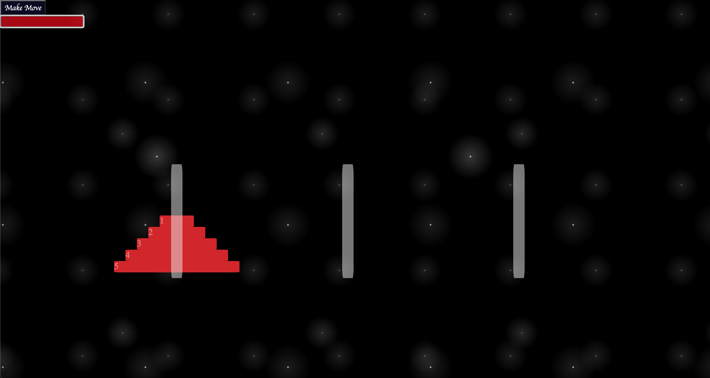

# Hanoi-Tower
This is a recreation of the Hanoi-Tower mathmatical puzzle. It will default to 5 peices when you press the Make Move button, or you can enter a number in the input field to select however many disks you would like to play with. Then, one disk will be moved each time you press the button. Keep in mind, the more disks you start with, the longer it takes to finish. If you were to put 64 disks, it would take BILLIONS of years to complete (so... don't do that :wink:).

<h2>To run:</h2>
Everything required to run this project is in this repository. To make it your own, just fork and clone this repository and make whatever changes you desire.

<h2>Roadmap of future improvements:</h2>
I would like to return to this file at a later date to customize the alert. I realize I may have to change the code for it entirely since the alert is currectly not affected by CSS styling. I will be coming back later on to play around with that. 
 
<h2>Support:</h2>
Feel free to email me at Aesteg89@gmail.com or message me on LinkedIn (https://www.linkedin.com/in/anna-stegmann-77825b136/) if you have any questions. 

<h2>License</h2>
MIT License
Copyright (c) 2022 Anna Stegmann

Permission is hereby granted, free of charge, to any person obtaining a copy of this software and associated documentation files (the "Software"), to deal in the Software without restriction, including without limitation the rights to use, copy, modify, merge, publish, distribute, sublicense, and/or sell copies of the Software, and to permit persons to whom the Software is furnished to do so, subject to the following conditions:

The above copyright notice and this permission notice shall be included in all copies or substantial portions of the Software.

THE SOFTWARE IS PROVIDED "AS IS", WITHOUT WARRANTY OF ANY KIND, EXPRESS OR IMPLIED, INCLUDING BUT NOT LIMITED TO THE WARRANTIES OF MERCHANTABILITY, FITNESS FOR A PARTICULAR PURPOSE AND NONINFRINGEMENT. IN NO EVENT SHALL THE AUTHORS OR COPYRIGHT HOLDERS BE LIABLE FOR ANY CLAIM, DAMAGES OR OTHER LIABILITY, WHETHER IN AN ACTION OF CONTRACT, TORT OR OTHERWISE, ARISING FROM, OUT OF OR IN CONNECTION WITH THE SOFTWARE OR THE USE OR OTHER DEALINGS IN THE SOFTWARE.
